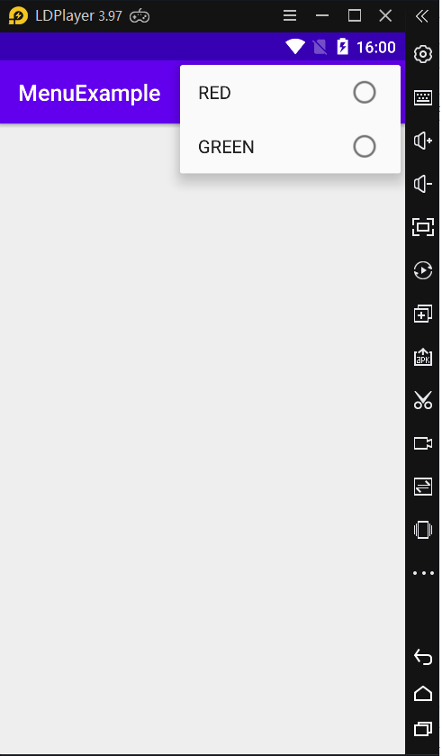
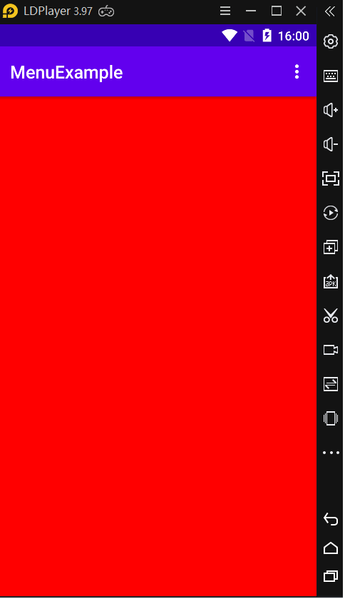
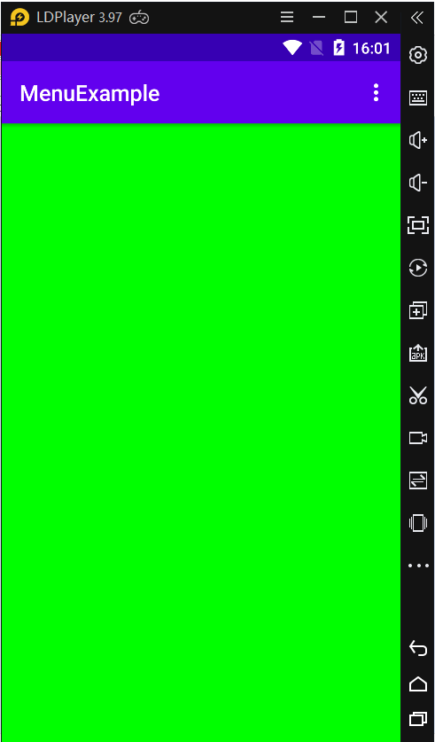

### Tạo và quản lý thực đơn tùy chọn (overflow menus) trong Android

- <a href= "https://ngocminhtran.com/2018/10/27/tao-va-quan-ly-thuc-don-tuy-chon-overflow-menus-trong-android/"> Ứng Dụng Từ Bài</a>

### Yêu Cầu
A. MÔ TẢ VỀ Android Studio:

### Thực đơn tùy chọn (the oveflow menu)
- Thực đơn tùy chọn (thường được gọi là overflow menu hay options menu) là thực đơn cho phép người dùng truy cập từ thiết bị và cho phép các nhà phát triển gộp các ứng dụng tùy chọn khác trong giao diện người dùng của ứng dụng. Ví dụ về thực đơn tùy chọn:

- Khi danh sách các tùy chọn trong thực đơn đến một giới hạn so với kích cỡ màn hình hiển thị, các tùy chọn có thể được thu gọn lại như hình sau:

- Vị trí của thực đơn tùy chọn tùy thuộc vào phiên bản Android. Từ Android 4.0 trở về sau, vị trí của thực đơn tùy chọn là gốc trên bên phải trên thanh tiêu đề của ứng dụng
- Tạo một thực đơn tùy chọn
- Để tiện lợi, chúng ta sẽ tạo một ứng dụng Android tên MenuExample, chọn API 14 và tên activity là MenuExampleActivity

### Tạo một thực đơn tùy chọn
- Để tiện lợi, chúng ta sẽ tạo một ứng dụng Android tên MenuExample, chọn API 14 và tên activity là MenuExampleActivity

- <a href= "https://github.com/ChanhMinions/DaoQuanhUngDungAndroid">Dạo quanh ứng dụng Android trong Android Studio 3.X</a>
- Một thực đơn (menu) và các tùy chọn (items hay options) của nó có thể được tạo trong một tập tin XML sử dụng phần tử <menu> và các phần tử con <item>. Ví dụ về việc tạo một thực đơn gồm hai tùy chọn RED và GREEN

### Hiển thị thực đơn tùy chọn
- Để hiển thị một thực đơn tùy chọn chúng ta dùng phương thức onCreateOptionsMenu. Với thực đơn chúng ta đã tạo ở trên, để hiển thị thực đơn này chúng ta thực hiện như sau:

- Mở tập tin MenuExampleActivity.java và thêm phương thức đến lớp MenuExampleActivity

### Sau khi chúng ta nhập xong phần Activity.java xong
- Chúng ta thực hiện chạy trên giả lập

### Chúng ta ấn vào dấu 3 chấm...
-thực thi lệnh red , sẽ hiện màu red

-thực thi lệnh Blue, sẽ hiện mà Blue

### Kết luận
- Trong bài này chúng ta đã tìm hiểu về thực đơn tùy chọn, một trong những thành phần quan trọng trên giao diện người dùng, trong Android. Mã nguồn hoàn chỉnh của các tập tin trong ứng dụng MenuExample

### Chúc Các Bạn Thành Công !!!

### Bạn Có Thể Xem Bài Tiếp Theo:

- <a href="https://github.com/ChanhMinions/ExplicitIntent">ĐỐI TƯỢNG INTENT TRONG ANDROID (Phần 1)!</a>

                                                                      Trần Phú , Ngày 23 tháng 7 Năm 2020

